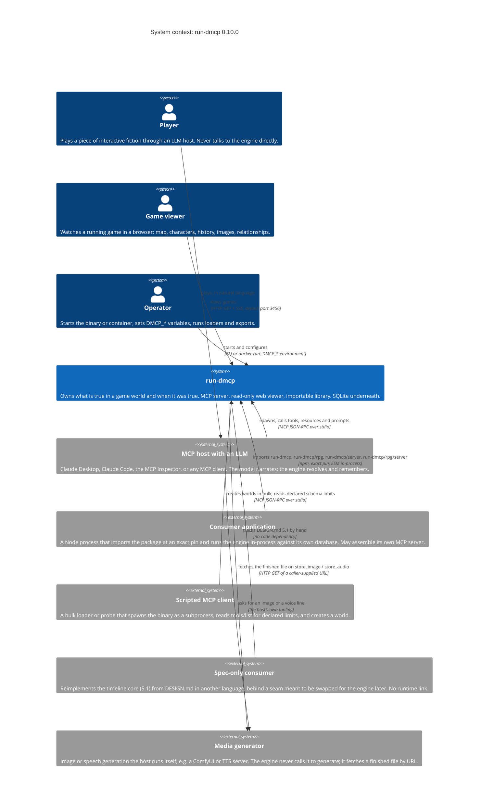
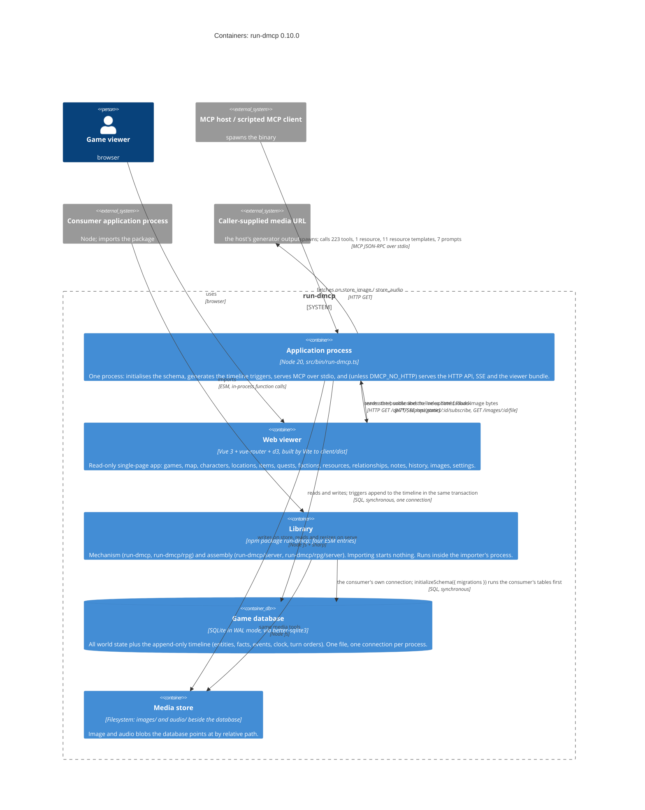
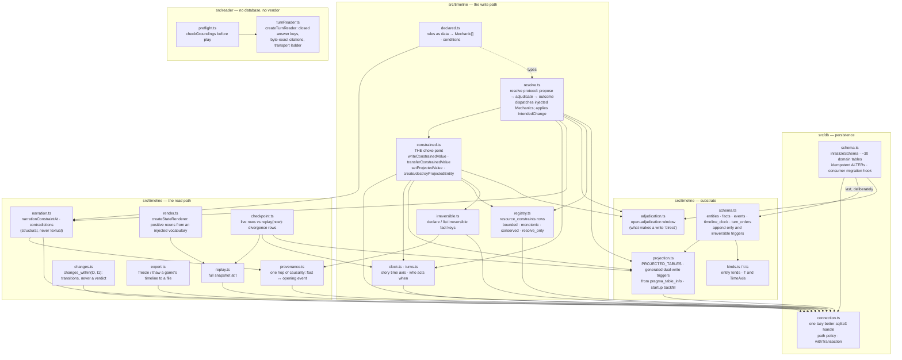
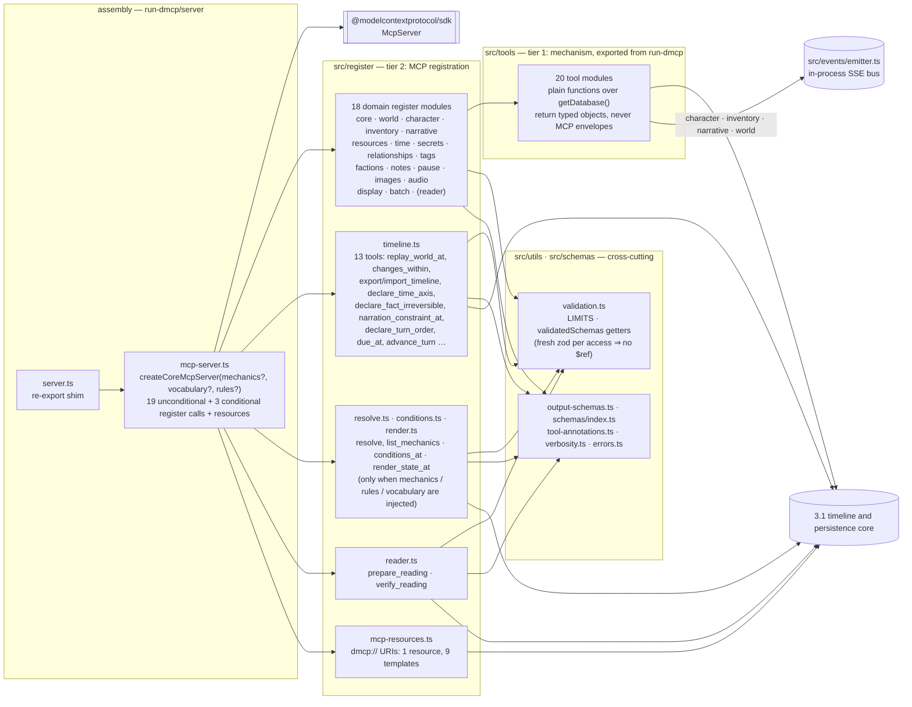
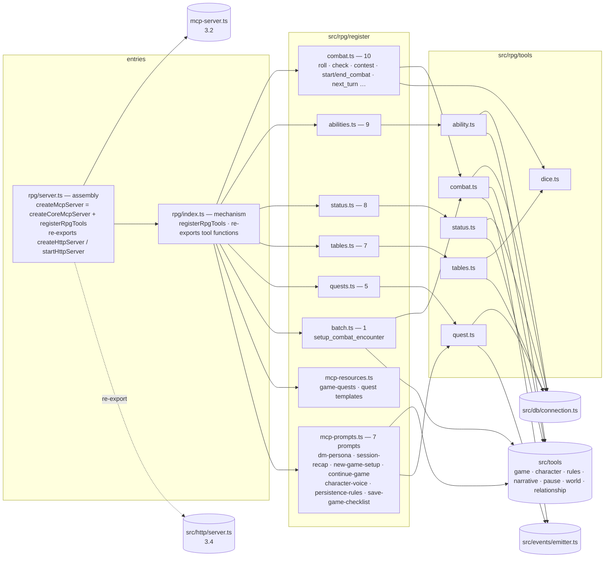
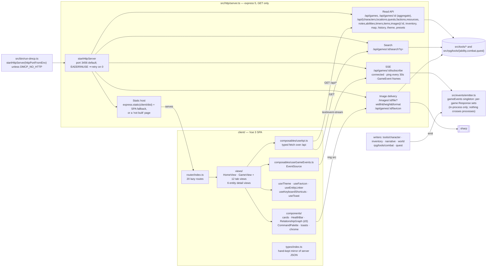

# run-dmcp architecture — C4 levels 1 to 3

This document describes run-dmcp with the [C4 model](https://c4model.com): the system in its
context (level 1), the containers it is made of (level 2), and the components inside each container
(level 3). Level 4, code, is deliberately not here — it changes faster than a document can follow,
and the tests named in [Boundaries that are enforced](#boundaries-that-are-enforced) are its real
record.

It was written against **0.10.0** and describes the tree as it stood on 2026-09-27. Counts and
names quoted here are pinned by tests where a test exists, and each such count says which test.
Where a statement is an inference rather than something the tree states outright, it says so.

**This is not the design authority.** [DESIGN.md](DESIGN.md) is, and section references of the
form §5.4 point into it. [../CLAUDE.md](../CLAUDE.md) holds the hard rules a change must respect.
This document only explains how the built thing is arranged so those two are easier to read.

**Consumers are described by role, not by name.** The engine belongs to none of them, and the
vocabulary guard (`src/__tests__/engineVocabulary.test.ts`) enforces that in every file but
DESIGN.md. Where a role below has a real instance, DESIGN.md §8 and the folder above this repository
name it.

The diagrams are Mermaid. Levels 1 and 2 use Mermaid's C4 notation; level 3 uses flowcharts,
because the C4 renderer does not lay out twenty components legibly.

---

## Level 1 — System context

run-dmcp is **an MCP server for LLM-run interactive fiction where the server owns what is true,
including when it was true.** A model narrates and classifies; the engine resolves, remembers, and
can say what the world looked like at any `t`.

It presents three surfaces to the outside, and they are served by two different shapes of the same
code:

| Surface | What it is | Who uses it |
|---|---|---|
| **MCP over stdio** | The application (`run-dmcp`, `dist/bin/run-dmcp.js`) speaks the Model Context Protocol over its own stdin/stdout. This is the only MCP transport. | An MCP host running a model; scripted MCP clients that spawn the binary. |
| **Read-only web viewer** | The same process serves an HTTP JSON API, a server-sent-events stream and a Vue single-page app. Every route is `GET`. | A person watching a game in a browser. |
| **The library** | Importing the npm package starts nothing. Four entries expose the mechanism and, separately, the server assembly. The consumer's own process runs the engine against the consumer's own database. | A consumer application written in Node. |

A fourth, indirect surface is **the frozen timeline export**: a file written by `export_timeline`
that a deterministic downstream consumer can depend on instead of the live server (§6, §15).

### What the context diagram is saying

- **The player is two hops away.** run-dmcp never sees natural language from a player. The host's
  model does, and calls tools. This is the whole thesis (§1): the model classifies and narrates, the
  server resolves and remembers.
- **Three of the four consumer roles exist today, one each.** As of 2026-09-27 one real consumer
  embeds the library and assembles its own MCP server from the mechanism entries; a second embeds
  the library and calls `replay`, `createResolver` and `createStateRenderer` with no MCP server at
  all; a third spawns the binary from a source checkout and drives it over stdio from Python; a
  fourth tracks the spec only. Nothing in this folder besides those four depends on run-dmcp.
- **The engine makes exactly one kind of outbound network call.** `storeImage` and `storeAudio`
  each `fetch()` a URL the caller passes in. There is no image-generation, speech, or model API
  client anywhere in `src/`. `sharp` is local processing only (metadata on store, resize on read).
  The reader (`src/reader/`) takes a caller-injected transport and has no vendor SDK, which
  `src/reader/__tests__/noVendorTransports.test.ts` enforces.
- **Distribution is out of frame but worth knowing.** The package is published to npm from a
  `v*.*.*` tag by `.github/workflows/release.yml` (OIDC trusted publishing, after lint, typecheck,
  unit tests, build and the Playwright acceptance suite). A container image can be pushed to
  `ghcr.io` by `docker-publish.yml`, which is `workflow_dispatch` only. `decision-markers.yml`
  comments on the GitHub issue a new `DECISION(#N):` marker cites.

---

## Level 2 — Containers

A C4 container is a separately runnable or deployable thing: a process, a browser app, a data
store, or a library linked into someone else's process. run-dmcp has five, and the first is really
the third with a `main()`.

### The containers

| Container | Technology | Responsibility | Notes |
|---|---|---|---|
| **Application process** | Node 20, `src/bin/run-dmcp.ts`, shipped as the `run-dmcp` bin and as the Docker entrypoint | The only code that opens the database on its own initiative, binds a port, or connects a transport. Startup order: `initializeSchema()` (which generates the timeline triggers), optional `DMCP_RULES_FILE`, `createMcpServer(...)`, `startHttpServer(...)` unless disabled, then `StdioServerTransport`. `SIGINT`/`SIGTERM` close the database and exit. | It is the assembly entry plus a `main()`. `src/__tests__/entrypoints.test.ts` spawns it and speaks MCP to it with HTTP on and off. |
| **Web viewer** | Vue 3.5, vue-router 4, d3 7, Vite 7; `client/` | Twenty routes over the read-only API; live refresh over SSE; a d3 relationship graph; per-game theming. No state library; module-level refs in composables. Its TypeScript types are a hand-kept mirror of the server's JSON shapes, not generated. | Served from `client/dist` by the same process. Shipped in the npm tarball from the release after 0.10.0 (`package.json` `files`, held by `src/__tests__/packaging.test.ts`); the 0.10.0 tarball and earlier omit it, and serve a "not built" page instead. |
| **Library** | ESM, TypeScript; `package.json` `exports` | `run-dmcp` and `run-dmcp/rpg` are **mechanism**: functions, constants, types, no MCP SDK loaded. `run-dmcp/server` (`createCoreMcpServer`) and `run-dmcp/rpg/server` (`createMcpServer`, plus `createHttpServer`/`startHttpServer`) are **assembly**. | The consumer decides when the schema comes up, where the database lives and whether anything listens. Two processes pointed at one file are two connections to one SQLite database; the in-process event bus does not cross that line. |
| **Game database** | SQLite, `journal_mode=WAL`, `foreign_keys=ON`, better-sqlite3 | Domain tables (about thirty, see level 3) plus the timeline substrate. Dual-write from domain tables into `facts`/`events` is done by **generated triggers**, regenerated at every startup from `pragma_table_info`, so consumer-added columns are projected without code changes. | Path: `DMCP_DB_PATH` verbatim (`:memory:` allowed); else `$XDG_DATA_HOME/dmcp/games.db` if that directory already exists; else `./data/games.db` under the process cwd. There is no migration framework: `initializeSchema()` is idempotent and runs every start. |
| **Media store** | Filesystem | `<dirname(db)>/images/` and `<dirname(db)>/audio/`. The database stores only a relative `file_path`. `src/utils/media-path.ts` keeps paths inside those directories. | Not projected into the timeline, and deliberately absent from timeline exports. |

### Three ways to deploy it

| Variant | What runs | Web viewer? | Database |
|---|---|---|---|
| `npm i -g run-dmcp && run-dmcp` (or an MCP host's `command:`) | Application process | Yes from the release after 0.10.0; 0.10.0 and earlier serve a "not built" page | Resolved from env / XDG / cwd |
| Docker image (`node:20-slim`, entrypoint `node dist/bin/run-dmcp.js`) | Application process | Yes, built into the image; `EXPOSE 3456` | `/app/data/games.db` by default |
| Embedded in a consumer | Library, inside the consumer's process | Only if the consumer calls `startHttpServer` from `run-dmcp/rpg/server` | The consumer's; it calls `initializeSchema()` itself |

---

## Level 3 — Components

The application process and the library share one source tree, so the component diagrams below are
of that tree. They are drawn in four cuts, following the seams the tests enforce rather than the
directory listing:

1. **Timeline and persistence core** — `src/db/`, `src/timeline/`, `src/reader/`
2. **Core MCP surface** — `src/mcp-server.ts`, `src/register/`, `src/tools/`, `src/utils/`, `src/schemas/`
3. **Tabletop layer** — `src/rpg/`
4. **HTTP server and web viewer** — `src/http/`, `src/events/`, `client/`

The dependency direction across the four is strict and tested: 4 → 3 → 2 → 1, and never back.
Core never imports `src/rpg/`; nothing under `src/tools/` or `src/register/` imports `src/http/`;
`src/timeline/constrained.ts` imports nothing from `src/tools/`.

### 3.1 Timeline and persistence core

This is the part of the engine that gives it a reason to exist (§5). Everything else is a way to
reach it.

| Component | Source | Responsibility |
|---|---|---|
| **Connection and data path** | `src/db/connection.ts` | The single lazily opened handle; `DMCP_DB_PATH` → XDG → cwd resolution; `withTransaction`. Everything below depends on it. |
| **Domain schema and migrations** | `src/db/schema.ts` | `CREATE TABLE IF NOT EXISTS` plus idempotent `try { ALTER } catch {}` for every domain table; validates and runs the consumer's `SchemaMigration[]` each inside its own transaction; then calls `initializeTimelineSchema()` **last** so consumer-added columns are seen by that startup's trigger generation. Also installs the SQL backstop for `resolve_only`. |
| **Timeline schema and guards** | `src/timeline/schema.ts` | `entities`, `facts`, `events`, `timeline_clock`, `turn_orders`; immutability triggers that permit exactly the sanctioned updates (closing an interval once, flipping `irreversible` 0→1 once, stamping `opened_by_event_id` once); the `BEFORE INSERT` trigger that refuses a fact contradicting an irreversible one (hard rule 5). |
| **Projection engine** | `src/timeline/projection.ts` | "The timeline writes itself." For each of eight projected tables (games, characters, locations, items, resources, relationships, factions, secrets) it regenerates AFTER INSERT/UPDATE/DELETE triggers from the live column list, then backfills anything the triggers never saw. No write site appends events by hand. |
| **Adjudication window** | `src/timeline/adjudication.ts` | A one-row marker that both the JS constraint check and the SQL trigger read to decide whether a `resolve_only` write arrived through the resolve protocol. Cleared at startup. |
| **Constraint registry** | `src/timeline/registry.ts` | Storage and lookup for declared constraints and conserved-set membership. |
| **Constrained value writer** | `src/timeline/constrained.ts` | Hard rule 7's single choke point. Checks `bounded`, `monotonic`, `conserved` and `resolve_only` in JS; `irreversible` is enforced by the trigger and only *translated* here on the failure path. Transfers between conserved members are atomic and never clamp. History is read back from fact intervals, never from a side table. |
| **Resolve protocol** | `src/timeline/resolve.ts` | §5.2a. A proposal names a mechanic and parameters; the resolver refuses out-of-turn actors and contradicted expectations, hands the mechanic an `AdjudicationInput` with **no database handle**, and applies the returned `IntendedChange[]` (write, transfer, set, create, destroy) through the choke point inside one adjudication window. The outcome is rows, never a verdict. |
| **Declared rules** | `src/timeline/declared.ts` | Mechanics and conditions as JSON (`DMCP_RULES_FILE`), validated and compiled into the same `Mechanic` interface, so a stock binary can adjudicate without TypeScript on the caller's side. |
| **Story clock and turn order** | `src/timeline/clock.ts`, `turns.ts` | Declares a game's `t` axis once (hard rule 6) and advances it; declares and queries who is due at `t`. |
| **Replay, changes, export, checkpoint** | `replay.ts`, `changes.ts`, `export.ts`, `checkpoint.ts` | Point snapshot at `t`; half-open interval scan of transitions (§5.5); freeze/thaw of a whole game's timeline (§6); live-vs-replayed divergence report. Each returns records. None returns a judgement. |
| **Narration constraint and renderer** | `narration.ts`, `render.ts`, `provenance.ts` | The outbound half of authority (§5.2b, §7): what holds at `t`, each fact with the event that opened it; a structural contradiction check against an opaque claim; a renderer that can only emit nouns and adjectives from a caller-injected vocabulary, so absence is unconstructable (hard rule 3). |
| **Turn reader and preflight** | `src/reader/turnReader.ts`, `preflight.ts` | One model call per unit of progress, with the model on the caller's side of an injected transport. The engine owns citation verification (byte-exact), the fallback ladder, coercion to closed answer keys and duplicate-source rejection. Preflight reuses the same citation rule on a declared world before play. |

Types shared by all of the above live in `src/types/index.ts`, including the `ConstraintKind`
vocabulary. `resource_history` and `relationship_history` still exist as tables but are frozen by
`BEFORE INSERT` triggers: a second history is unconstructable rather than discouraged (§5.4).

### 3.2 Core MCP surface

Two tiers, and a small set of exceptions that go straight to the timeline.

**Tier 1, `src/tools/*.ts`**, is twenty modules of plain exported functions (`createCharacter`,
`updateResourceValue`, …). Each calls `getDatabase()` lazily, does its own existence checks, writes
constrained values through `src/timeline/constrained.ts`, and emits a UI event where the viewer
needs one. They know nothing about MCP. All twenty are star-exported from `src/index.ts`, so a
library consumer calls them in-process with no transport.

**Tier 2, `src/register/*.ts`**, is one `registerXTools(server)` function per module that calls
`server.registerTool(name, { description, inputSchema, outputSchema?, annotations }, handler)` once
per tool, where the handler calls tier 1 and wraps the result as MCP `content` plus
`structuredContent`. Every string in every `inputSchema` carries a `maxLength` from `LIMITS`, and no
published schema contains a `$ref`; `src/__tests__/schemaBounds.test.ts` checks the bytes a real
client receives from `tools/list`. Output schemas carry no bounds on purpose, because a bound on
generated content would be a promise a validating client could enforce against the engine.

**The exceptions are the point.** `register/timeline.ts`, `resolve.ts`, `conditions.ts`,
`render.ts` and `reader.ts` have no tier-1 partner. They call `src/timeline/*` and `src/reader/*`
directly, because those primitives are already the "library function first, MCP tool second"
surface. Three of them register only when the assembling caller injects something: `resolve` and
`list_mechanics` need mechanics (TypeScript or declared), `conditions_at` needs declared rules,
`render_state_at` needs a vocabulary. The stock binary gets `resolve` and `conditions_at` only via
`DMCP_RULES_FILE`, and never gets `render_state_at`.

**Assembly.** `createCoreMcpServer` is a flat, hand-written sequence of register calls, not a
loop. No database handle or event bus is threaded through it: both are module singletons reached by
tier 1 at call time, which is why constructing a server opens no database. `register/core.ts` is
the largest module (game lifecycle, the preferences interview, image-generation presets, rules) but
it is one domain module among the rest, not an orchestrator.

| Register module | Tools | Domain |
|---|---|---|
| core | 22 | game lifecycle, interview, presets, rules |
| world | 6 | locations, connections, map |
| character | 10 | characters, movement, health, conditions |
| inventory | 6 | items and transfer |
| narrative | 8 | event log, history, export styles, player choices |
| resources | 11 | resources, value writes and transfers, constraint declarations |
| time | 13 | in-world calendar and clock, scheduled events, timers |
| secrets | 9 | secrets, clues, knowledge |
| relationships | 7 | relationships and their history |
| tags | 5 | tagging and lookup |
| factions | 8 | factions, goals, traits |
| notes | 9 | notes, search, recap |
| pause | 15 | session continuity: pause checklist, snapshots, freshness, an inbox of external updates |
| images | 14 | stored images, primary image, prompt templates (text only) |
| audio | 11 | stored audio, voice references |
| display | 10 | display config and theme presets for the viewer |
| batch | 4 | multi-entity conveniences composed from the above |
| timeline | 13 | the level-3.1 read and declaration surface |
| reader | 2 | prepare and verify a reading |
| resolve, conditions, render | 2 + 1 + 1 | conditional, see above |
| mcp-resources | 0 tools; 1 resource + 9 templates | read-only `dmcp://` views |

Unconditional core tools: **183**. With every optional feature injected: 187. Tool names are the
published API and change with issues; the authority is `tools/list` on a running server and the
golden set in `src/__tests__/layerBoundary.test.ts`, not this table.

### 3.3 Tabletop layer

Dice, combat, abilities, status effects, random tables and quests are genuinely game-shaped and sit
above the core as `run-dmcp/rpg` (§8). The layer follows the same two tiers.

Three things are worth knowing that the directory listing does not show:

- **It adds 40 tools, 2 resource templates and 7 prompts**, and the union with the core is exactly
  the 223 / 1 / 11 / 7 golden surface `layerBoundary.test.ts` pins. The same test walks the runtime
  import graph from `src/index.ts` and fails, naming the chain, if core ever reaches into `src/rpg/`.
- **Its tables live in the core schema file.** `quests`, `combats`, `random_tables`, `abilities`
  and `status_effects` are created unconditionally by `src/db/schema.ts`. The core/tabletop split is
  a code-organisation boundary over one physical schema, not a schema partition. The consumer
  migration hook is for external consumers, not for this layer.
- **The tabletop tools do not call the timeline directly.** Where they write a projected table, the
  generated triggers append to the timeline for them.

### 3.4 HTTP server and web viewer

- **Read-only is structural.** Every route is `GET`; `e2e/specs/api-readonly.spec.ts` fails if a
  writing verb appears. There is no authentication and no CORS middleware: this is a local viewer
  for the person running the game, not a hardened API.
- **The HTTP handlers call the same tier-1 functions the MCP tools call**, in the same process, on
  the same connection. There is no second read model.
- **The event bus is a UI convenience, not the timeline.** `src/events/emitter.ts` holds express
  `Response` objects per game and writes SSE frames to them when a tier-1 writer emits. Events for a
  game nobody is watching are dropped. A consumer running the library in its own process emits into
  its own singleton; a separately running viewer on the same database file never hears it.
- **Reachability.** `src/http/server.ts` is re-exported only from `src/rpg/server.ts`, because it
  imports tabletop tools. The mechanism entries cannot reach it, which
  `src/__tests__/assemblyBoundary.test.ts` and `entrypoints.test.ts` hold.
- **The client's tests are thin** (one composable test under vitest with happy-dom). The real
  coverage is the Playwright acceptance suite at the repo root, which boots the built app on port 0
  against a temp database and runs three projects: a stdio MCP harness, the JSON/SSE API, and
  Chromium against `client/dist`.

---

## Presentation copies, and how fast they rot

A hand-laid, styled copy of each of the six diagrams above lives on a Claude Design canvas:
<https://claude.ai/artifact/Qu38NzWrAXNvb29i6h83Na> (private; share from the canvas if someone else
needs it). Those boards exist for onboarding, a README hero, or a talk. **They are not the source
of truth and are never edited by hand.** The Mermaid in this file is what CI sees and what a pull
request diffs; a board is regenerated from this file when the file changes, and when the two
disagree, this file wins.

Expect the boards to drift, and expect the detailed ones to drift first:

| Board | Goes stale when | Expected drift |
|---|---|---|
| Level 3.1 to 3.4, components | a file is added under `src/timeline/`, a register module or route lands, a view is added | fast, with almost every feature issue |
| Level 2, containers | a container, protocol or deployment shape changes | medium, a few times a year |
| Level 1, system context | a new kind of consumer or a new outward surface appears | slow, rarely |

Each board's footer states the version it was drawn from and its expected drift, and the canvas
carries the same note beside the boards. When a pinned count in this file changes, the board that
quotes it is wrong until it is regenerated; that is acceptable, and the footer says so.

---

## Boundaries that are enforced

The architecture above is not a convention. Each line in it that matters has a test that goes red
when it is crossed, and the test is the durable record; this document is the map to it.

| Boundary | Test | What goes red |
|---|---|---|
| Library imports start nothing; only `bin` opens, binds or connects | `src/__tests__/entrypoints.test.ts` | A child process importing `src/index.ts` cannot exit |
| Mechanism entries never load the MCP SDK, register modules or express | `src/__tests__/assemblyBoundary.test.ts` | Names the runtime import chain |
| Core never reaches `src/rpg/`; core + tabletop = 223 / 1 / 11 / 7, disjoint | `src/__tests__/layerBoundary.test.ts` | Names the chain, or the diff against the golden surface |
| A consumer can drive a whole world through library calls, with its own tables via the migration hook | `src/__tests__/consumerSurface.test.ts` | The library-only path fails |
| Every string input is bounded; no published `$ref` | `src/__tests__/schemaBounds.test.ts` | Walks the bytes of `tools/list` over an in-memory transport |
| No consumer's vocabulary in the tree, tracked or untracked, except `docs/DESIGN.md` | `src/__tests__/engineVocabulary.test.ts` | Names the file and the word |
| `DECISION(#N):` markers are well-formed and never silently deleted | `src/__tests__/deferredDecisions.test.ts` | The marker set shrank |
| The reader has no vendor SDK or network code | `src/reader/__tests__/noVendorTransports.test.ts` | An import that should not exist |
| The HTTP API has no writing verb | `e2e/specs/api-readonly.spec.ts` | A non-GET route |
| The shipped binary's MCP surface, with and without rules | `e2e/specs/mcp-invariants.spec.ts`, `mcp-lifecycle.spec.ts` | Spawns `dist/bin/run-dmcp.js` over stdio |

---

## Configuration reference

All read by the application process (`src/bin/run-dmcp.ts`, `src/db/connection.ts`,
`src/utils/webui.ts`, `src/utils/logger.ts`). A library consumer that never calls `getDatabase()`
without setting `DMCP_DB_PATH` gets the same resolution rules in its own cwd.

| Variable | Default | Effect |
|---|---|---|
| `DMCP_DB_PATH` | unset | SQLite path, used verbatim. `:memory:` allowed (the unit suite sets it). |
| `XDG_DATA_HOME` | `~/.local/share` | Fallback `…/dmcp/games.db`, only if that directory already exists. |
| (neither) | `./data/games.db` | Under the process cwd, never inside `node_modules`. |
| `DMCP_HTTP_PORT` | `3456` | Viewer port. Invalid values fall back to 3456; `0` means any free port. If the port is busy the server retries on 0 and logs the port it got. The Dockerfile's `EXPOSE` and the client's dev proxy both quote this default, and `src/__tests__/packaging.test.ts` holds them to it. |
| `DMCP_NO_HTTP` | unset (viewer on) | Any value other than `0`, `false` or empty disables HTTP entirely. A host that spawns the binary as a subprocess wants this. |
| `DMCP_LOG_LEVEL` | `info` | `debug`, `info`, `warn`, `error`. Logs go to stderr because stdout carries JSON-RPC. |
| `DMCP_RULES_FILE` | unset | A declared-rules JSON file. Adds `resolve`, `list_mechanics` and `conditions_at` to the stock binary. Invalid rules stop startup. |

The MCP server identifies itself to clients as `dmcp` / `0.10.0` (`SERVER_NAME`, `SERVER_VERSION`
in `src/mcp-server.ts`).

---

## Discrepancies found while writing this

Five turned up, each the same shape: a fact stated in one place that nothing compared against the
place the fact lives. Four were fixed in the commit that added this document, and
`src/__tests__/packaging.test.ts` now holds them; the fifth is on the tracker.

1. **The npm tarball shipped no web viewer.** `package.json` `files` covered `dist/`, `README.md`
   and `LICENSE`, while the server looks for the bundle at `<package>/client/dist`. Fixed: the
   directory is in `files`, and `client/.npmignore` exists so that npm stops reading
   `client/.gitignore` (which lists `dist`) while packing; npm honours a subdirectory's ignore files
   but not a nested `package.json`. The test checks the declaration and, where a built client
   exists, the output of `npm pack --dry-run`.
2. **"Twenty-one register modules"** in `CLAUDE.md`, `README.md`, `src/server.ts`,
   `src/rpg/server.ts` and `src/index.ts` was stale. Fixed to twenty-three core, thirty-one with
   the tabletop layer; the test counts the directories and fails naming those five places when the
   number moves again.
3. **The client's Vite dev proxy targeted port 3000**; the server default is 3456. Fixed, and held
   to `DEFAULT_HTTP_PORT`.
4. **The Dockerfile declared no port** and its comment mentioned only stdio. Fixed: `EXPOSE 3456`
   and a comment on `DMCP_NO_HTTP`.
5. **The client's TypeScript types are a hand-kept mirror** of the server's JSON shapes
   (`client/src/types/index.ts`), and nothing checks them against `src/types/index.ts`. Open as
   [#44](https://github.com/JavaDerek/run-dmcp/issues/44), with three options and no decision.

---

## Maintaining this document

- It is level 1 to 3 only. Do not add function signatures, line numbers or tool-name lists beyond
  what is here; those rot, and the tests above are their record.
- When a count changes (tools, register modules, projected tables, routes), change it here in the
  same commit and say which test pinned the new number.
- When a new boundary test lands, add a row to [Boundaries that are enforced](#boundaries-that-are-enforced).
- Consumers stay anonymous here. Roles, not names; DESIGN.md §8 is where names are allowed.
